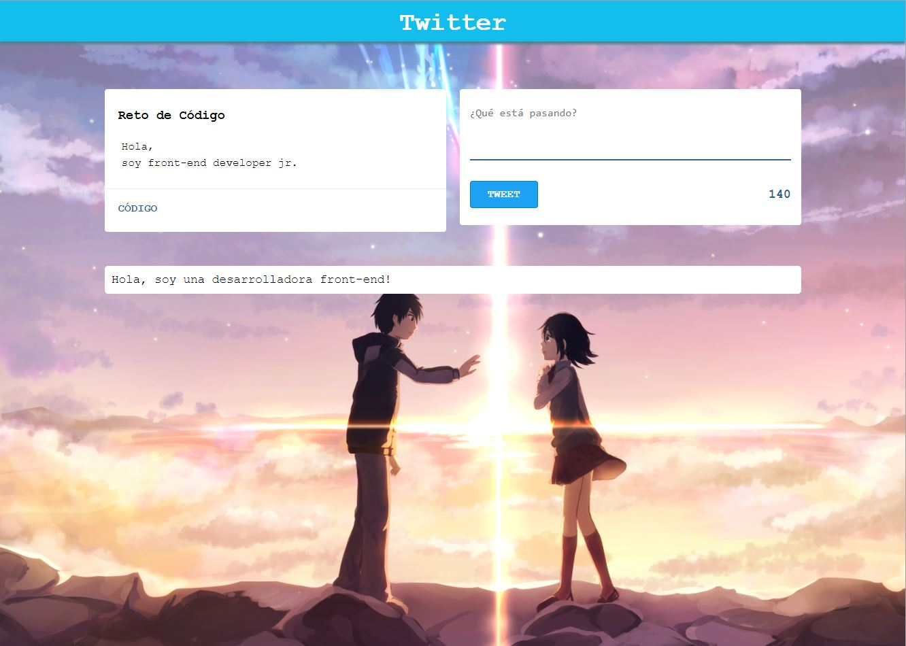
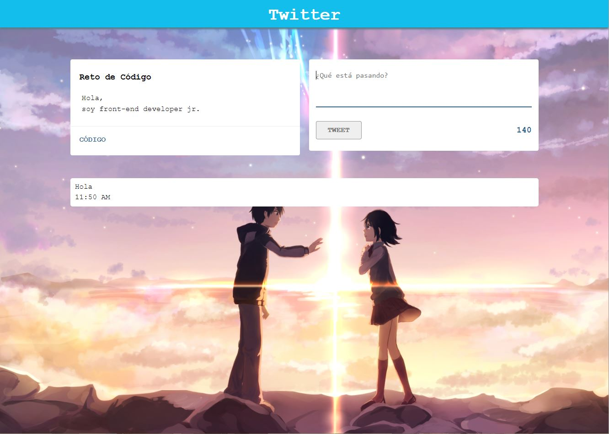

# **Twitter**

--------------------------------------------------------------------------------------------------------------------------------------------------------------------------------------------------------------------------------------------------

[](http://forthebadge.com)
[](http://forthebadge.com)
[](http://forthebadge.com)
[](http://forthebadge.com)
[](http://forthebadge.com)

## **Objetivo**

El objetivo de este trabajo es crear una aplicación diseñada solo para desktops que replique el newsfeed de Twitter, donde los usuarios puedan publicar sus 'tweets' siguiendo las mismas reglas de dicha red social.


## **Herramientas Tecnológicas Empleadas**

* HTML5

* CSS3

* Javascript

* Librería de Javascript Moment

* Guía de Estilos

## **Reglas del Newsfeed**

* No se puede ingresar texto vacío.

* Solo se pueden escribir mensajes que contengan máximo 140 caracteres, pasado dicho número el botón para publicar será deshabilitado.


## **Versiones**

He creado seis versiones de este newsfeed, cada una con las siguientes funcionalidades:

### **Versión 0.0.1**

* En esta versión el usuario podrá publicar sus mensajes sin ninguna de las restricciones anteriormente mencionadas.



### **Versión 0.0.2**

* No se puede ingresar texto vacío(se deshabilitará el botón para publicar).
* Está disponible un contador de caracteres regresivo.


### **Versión 0.0.3**

* Si la cantidad de caracteres restantes pasa de los 140 se deshabilitará el botón para publicar.
* El contador cambiará de color, indicandole el número de caracteres restantes:
  * Si pasa los 120 caracteres, mostrar el contador de color amarillo.
  * Si pasa los 130 caracteres, mostrar el contador de color carmesí.
  * Si pasa los 140 caracteres, mostrar el contador de color rojo.


### **Versión 0.0.4**

* Al presionar enter, el textarea crecerá de acuerdo al tamaño del texto.


### **Versión 0.0.5**

* Si la cantidad de caracteres ingresados (sin dar un enter), supera al tamaño del textarea por defecto, se agregará una línea.


### **Versión 0.0.6**

* El tweet mostrará la hora de su publicación en el formato de 24 horas: ```hh:mm```.



## **Flujo de la Aplicación**

* El usuario escribe cualquier mensaje que quiera publicar en el área de texto.

* Hace click al botón Tweet si este está disponible(ver Reglas del Newsfeed).

* Su tweet aparecerá en el newsfeed.